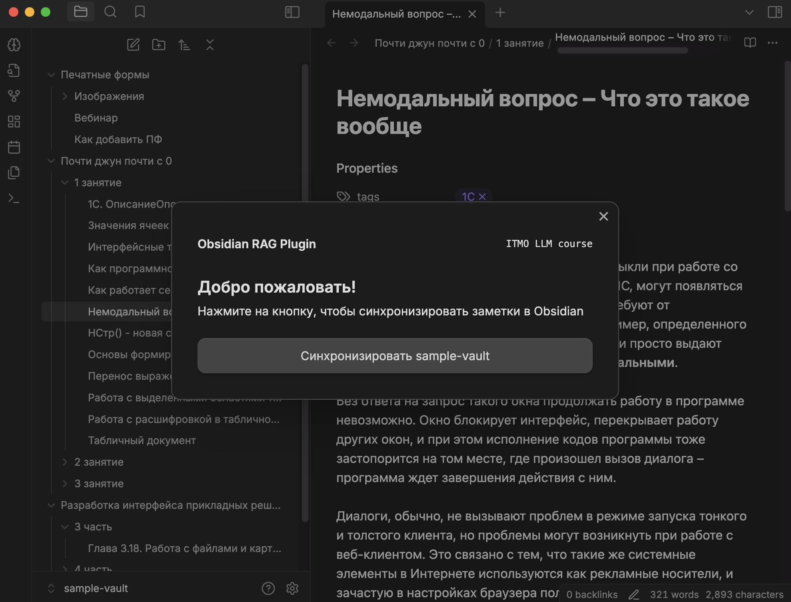
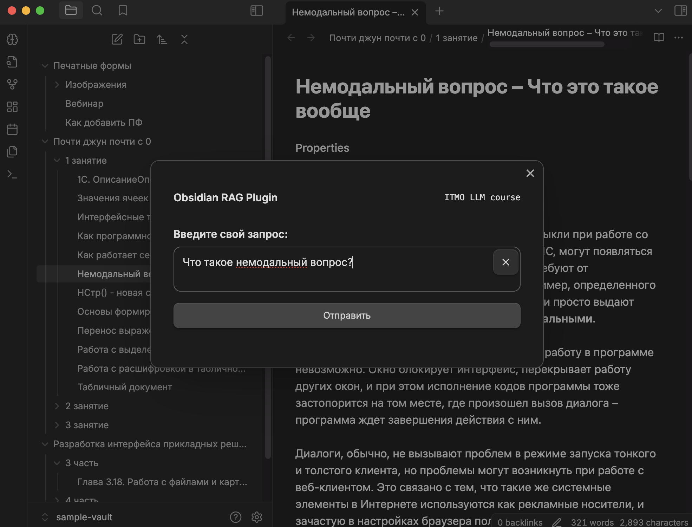
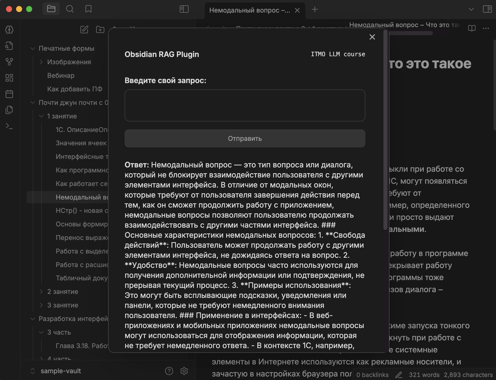

# Obsidian RAG Plugin (TBD Team)

## Demo Web App
https://llm-course.kladnitsky.ru/

## Obsidian Plugin
https://github.com/danilkladnitsky/obsidian-rag-plugin/releases

## Интерфейс






## Как запустить
### AI Tunnel
https://aitunnel.ru/#models

1. Подготовьте API-токен от AI Tunnel
2. Создайте файл .env в корне проекта
```bash
LLM_API_KEY=<Ваш токен>
```
3. Запустите проект через docker
```bash
docker compose -f docker-compose.yml --env-file .env up --build
```
4. Фронтенд будет запущен на 82 порту, бэкенд - на 8000

### OpenAI
1. Подготовьте API-токен от OpenAI и положите его в переменную ```LLM_API_KEY```
3. Следуйте шагам 2-4 в кейсе с AI Tunnel


## Метрики
| dataset | context_precision | faithfulness  | answer_relevancy   | context_recall |
|--------|-------------------|---|----|----------------|
| hmao_npa | 0.7516,           | 0.7393  |  0.6624   | 0.8526         |


## Авторы
Данил Кладницкий (tg: @danilkladnitsky)

Аверченко Марк Алексеевич (tg: @marcenavuc)

Бондарчук Анастасия Ивановна (tg: @Spirit_Green)
